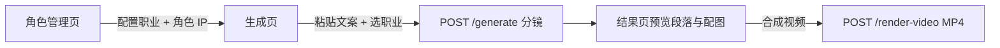
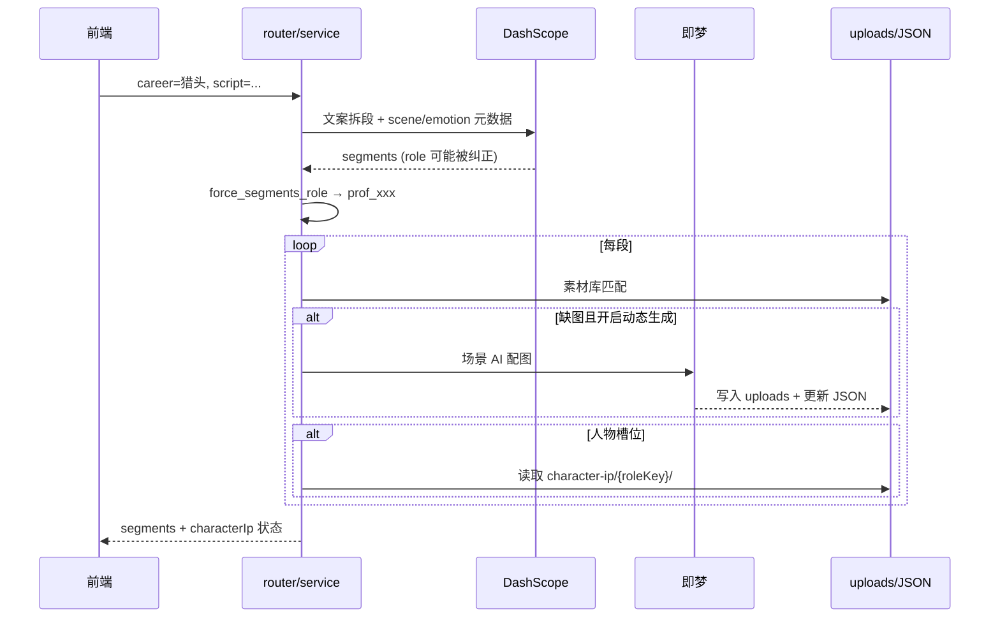

# AI 短剧（职业观察局）技术说明

面向开发与运维：说明前后端如何协作、数据存在哪里、以及近期行为约定（**以用户所选职业为准**，不在 Prompt 里写死内置六种角色）。

---

## 1. 产品流程（用户视角）



| 步骤 | 前端路由 | 后端 |
|------|----------|------|
| 管理职业与角色 IP | `/tools/ai-short-drama/characters` | `/ai-short-drama/character-ip/*` |
| 管理场景素材（可选） | `/tools/ai-short-drama/materials` | `/ai-short-drama/materials/*` |
| 生成分镜 | `/tools/ai-short-drama` | `POST /ai-short-drama/generate` |
| 合成成片 | 结果页按钮 | `POST /ai-short-drama/render-video` |

**默认配图策略（当前前端）**：未上传场景素材时，**自动调用即梦**为每段生成场景图（`generate_dynamic_materials: true`）。人物镜头使用**该职业已启用的角色 IP**，不依赖素材库里的 character 类型 PNG。

---

## 2. 与 RAG 的区别（勿混用）

| 能力 | 环境变量 / 存储 | 检索方式 |
|------|-----------------|----------|
| **RAG 问答** | `RAG_DATABASE_URL`（PostgreSQL + pgvector） | 向量相似度 |
| **短剧素材库** | `SHORT_DRAMA_DATABASE_URL` **留空** → 本地 `data/short_drama_materials.json` + `uploads/short-drama/` | 标签 / 类型 / 规则打分，**不是向量库** |
| **角色 IP** | `data/short_drama_character_ip.json` + `uploads/short-drama/character-ip/` | 按 `roleKey` 取当前 `isActive` 记录 |
| **职业注册表** | `data/short_drama_professions.json` | 中文名 ↔ `roleKey` |

---

## 3. 核心原则：选什么职业，用什么素材

### 3.1 单一数据源：职业注册表

- 文件：`data/short_drama_professions.json`
- 内置：程序员、产品经理、HR、测试、运维、销售
- 用户可新增：如「猎头」→ `roleKey` 为 `prof_xxxx`（自动生成）

解析逻辑集中在 `app/ai_short_drama/role_catalog.py`：

- `resolve_role_key(中文职业名, AI 提示的 role)`：**用户选择的中文名优先**于 AI 返回的 `hr` 等内置 key
- `resolve_from_user_selection(职业名)`：生成页下拉框专用
- `force_segments_role(segments, roleKey)`：强制全片段落 `role` / `imageTags` 与所选职业一致

### 3.2 生成页职业选择

- 前端下拉的值是职业的**中文名**（如 `猎头`），请求体字段 `career`
- **务必选择具体职业**，不要依赖「自动识别」；否则 DashScope 可能把猎头类文案标成 `hr`
- 后端在素材匹配前会再次执行 `_apply_user_role_selection`，覆盖 AI 误标

### 3.3 角色 IP vs 场景图

| 素材类型 | 来源 | 说明 |
|----------|------|------|
| **人物** | 角色管理里该 `roleKey` 的**已启用** IP | `character_ip_store.get_active(role)` |
| **场景 / UI / 特效** | 素材库命中 或 即梦 AI 生成 | `material_matcher` + `material_generation_service` |

---

## 4. 生成流水线（`POST /generate`）



主要模块：

| 模块 | 职责 |
|------|------|
| `prompt.py` | 拆段 Prompt；职业表**动态**注入 `prompt_role_catalog_block()` |
| `service.py` | `_generate_from_script` / `_attach_materials` |
| `video_material_plan.py` | 规划哪些段用人物 IP / 场景 / UI |
| `material_matcher.py` | 单段配图（库 → AI 补图） |
| `material_generation_service.py` | 即梦生成 + 缓存 key |
| `role_catalog.py` | 职业解析与全片 role 校正 |

日志关键字：`[generate]`、`[素材匹配]`、`[AI生成]`、`[角色IP]`；请求进出：`app.request` 的 `→ POST /ai-short-drama/generate`。

---

## 5. 角色 IP 生成（差异化）

`character_ip_service.generate_ai_candidates`：

1. `analyze_existing_character_diversity`：读取**其他职业**已启用 IP 图（最多 6 张），通义 VL 总结共性并给出差异化建议（需 `DASHSCOPE_API_KEY`）
2. `build_prompts_for_generation`：通用约束 + 四档不同造型（性别/年龄/色系/景别）+ 职业描述
3. 并行 4 张候选 → `uploads/short-drama/character-ip/{roleKey}/`

相关文件：`character_ip_prompt.py`、`character_ip_store.py`。

---

## 6. 素材库与磁盘同步

启动时 `main.py` 会调用 `reconcile_material_store()`：

- 扫描 `uploads/short-drama/` 写入 `short_drama_materials.json`
- 移除历史的 `public/short-drama/*.svg` 占位索引

手动同步：`POST /ai-short-drama/materials/sync-from-disk`（素材管理页刷新时前端也会调）。

真实图片路径示例：

```text
uploads/short-drama/scenes/desk/desk_008.png
uploads/short-drama/character-ip/prof_cbb78e8a/ip_xxxx.png
```

访问 URL：`/uploads/short-drama/...`（FastAPI 静态挂载）。

---

## 7. 环境变量

见 `.env.example`。短剧相关：

| 变量 | 默认 | 说明 |
|------|------|------|
| `DASHSCOPE_API_KEY` | — | 文案拆段、角色差异化视觉分析 |
| `SHORT_DRAMA_SCRIPT_TIMEOUT_SECONDS` | `90` | 整次文案分析超时 |
| `SHORT_DRAMA_AI_MATERIAL_TIMEOUT_SECONDS` | `90` | 单段即梦配图超时 |
| `SHORT_DRAMA_AI_MATERIAL_PARALLEL` | `3` | 多段配图并发数 |
| `JIMENG_API_KEY` | — | 场景 AI 配图、角色 IP 生成 |
| `JIMENG_API_BASE_URL` | 火山方舟 v3 | OpenAI 兼容图片接口 |
| `JIMENG_MODEL` | seedream 4.0 | |
| `JIMENG_TIMEOUT_SECONDS` | `120` | |
| `SHORT_DRAMA_DATABASE_URL` | 空 | **留空**用本地 JSON；勿填 RAG 库地址 |
| `SHORT_DRAMA_STARTUP_CLEANUP` | `false` | 启动扫描删无效图（本地建议关） |

---

## 8. 主要 API（前缀 `/ai-short-drama`）

### 成片

| 方法 | 路径 | 说明 |
|------|------|------|
| POST | `/generate` | 文案 → 分镜 + 配图 |
| POST | `/render-video` | 分镜 → MP4（输出在 `generated/short-drama/`） |
| GET | `/bgm-tracks` | BGM 列表 |

### 职业与角色 IP（`/character-ip`）

| 方法 | 路径 | 说明 |
|------|------|------|
| GET/POST/PATCH/DELETE | `/character-ip/professions` | 职业 CRUD |
| GET | `/character-ip/workbench` | 各职业 active + pending |
| POST | `/character-ip/ai-generate` | AI 生成 4 候选 |
| POST | `/character-ip/upload` | 上传角色图 |
| POST | `/character-ip/{id}/activate` | 启用某一候选 |

### 素材（`/materials`）

| 方法 | 路径 | 说明 |
|------|------|------|
| GET | `/materials` | 列表 |
| POST | `/materials/upload` | 上传 |
| POST | `/materials/sync-from-disk` | 从 uploads 同步索引 |
| POST | `/materials/ai-tag-and-save` | 视觉打标 |
| DELETE | `/materials/{id}` | 删除 |

前端开发代理：`vite.config.js` 将 `/api/ai-short-drama` → `http://127.0.0.1:8000/ai-short-drama`。

---

## 9. 前端约定

| 文件 | 说明 |
|------|------|
| `lib/shortDramaApi.js` | `generate` 超时 **30 分钟**；默认 `generate_dynamic_materials: true` |
| `views/AiShortDramaPage.vue` | 生成 / 结果 / 合成视频 |
| `stores/professionStore.js` | 职业下拉来自后端 |
| `components/roles/RoleCard.vue` | 角色 IP 生成与启用 |

---

## 10. 常见问题

### 选了「猎头」但段落显示 HR 图

- 原因：旧逻辑信 AI 的 `role: hr`；或未选职业走自动识别
- 处理：选具体职业后重新生成；确认 `role_catalog` 已部署；日志应出现 `[generate] materials use selected career=猎头 roleKey=prof_...`

### 前端报「生成超时」但后端仍在跑

- 长文案 + 全片 AI 配图可达 **10～20 分钟**
- 前端 `GENERATE_TIMEOUT_MS = 1_800_000`（30 分钟）；看终端 `← POST /generate ...s`

### 第一次很慢、第二次快

- 场景图有 `material_cache`（scene+emotion+tags）；角色 IP 生成一次即可复用

### `material_generation` 曾报 `NoneType has no attribute get`

- 已修：`material_generation_service` 入库成功必须 `return`；单段失败降级为 missing，不拖垮整片

### 没有 MP4

- `/generate` 只出分镜；需在结果页点 **合成视频** 调 `/render-video`

---

## 11. 代码目录速查

```text
app/ai_short_drama/
  role_catalog.py          # 职业解析（核心）
  service.py               # 生成主流程
  prompt.py                # LLM Prompt（动态职业表）
  material_matcher.py      # 单段配图
  material_generation_service.py  # 即梦场景图
  character_ip_service.py  # 角色 IP 生成
  character_ip_prompt.py   # 角色 Prompt + 差异化视觉分析
  profession_store.py      # 职业注册表
  character_ip_store.py    # 角色 IP 存储
  material_store.py        # 素材索引
  material_sync.py         # 磁盘 ↔ JSON
  router.py / *_api.py     # HTTP 路由

data/
  short_drama_professions.json
  short_drama_materials.json
  short_drama_character_ip.json

uploads/short-drama/
generated/short-drama/     # 渲染出的 MP4
```

---

## 12. 本地启动（勿在生产中随意重启）

```bash
# 后端
cd ai-tools-web/ai-tools-backend
source .venv/bin/activate
python -m app.main   # http://0.0.0.0:8000

# 前端
cd ai-tools-web/ai-tools-frontend
npm run dev          # http://localhost:5173
```

修改 Python 代码后，若已开 `reload=True`，保存即可热重载；**无需为了文档更新而重启**。
